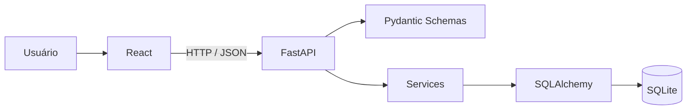

# Arquitetura

O frontend é responsável pela interface e comunicação HTTP. O backend recebe as requisições, valida dados, aplica regras de negócio e persiste dados usando SQLAlchemy.

A base inicial não implementa histórias de usuário. Ela fornece a infraestrutura compartilhada para que cada integrante possa trabalhar em suas histórias.
