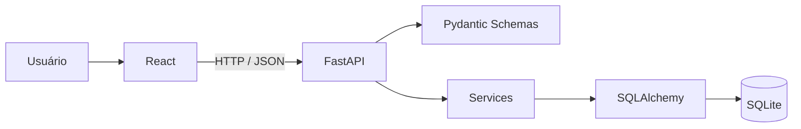

# Arquitetura

```mermaid
flowchart LR
    U[Usuário] --> R[React]
    R -->|HTTP / JSON| API[FastAPI]
    API --> SCH[Pydantic Schemas]
    API --> SVC[Services]
    SVC --> ORM[SQLAlchemy]
    ORM --> DB[(SQLite)]
```

O frontend é responsável pela interface e comunicação HTTP. O backend recebe as requisições, valida dados, aplica regras de negócio e persiste dados usando SQLAlchemy.

## Módulos de Interface Implementados

### Pesquisa e Ordenação de Receitas (US03 e US05)
- **Páginas**:
  - `ExplorarReceitas.jsx`: Rota `/receitas` integrando busca por nome, filtro de categorias e seletor de ordenação.
- **Componentes (`src/components/receitas/`)**:
  - `BarraPesquisa.jsx`: Input com busca textual e botão de limpeza (US03).
  - `FiltroCategoria.jsx`: Seleção interativa por pills das categorias cadastradas (US03).
  - `OrdenadorAvaliacao.jsx`: Dropdown para ordenação por avaliação calculada (US05).
  - `EstrelasPontuacao.jsx`: Exibição visual de estrelas e nota média (US05).
  - `ReceitaCard.jsx` e `ListaReceitas.jsx`: Apresentação em cards com estados de carregamento e lista vazia.
- **Hooks & Integração (`src/hooks/useReceitas.js`, `src/api/receitas.js`)**:
  - Gerenciamento de estado reativo com debounce e integração HTTP com a API REST.
